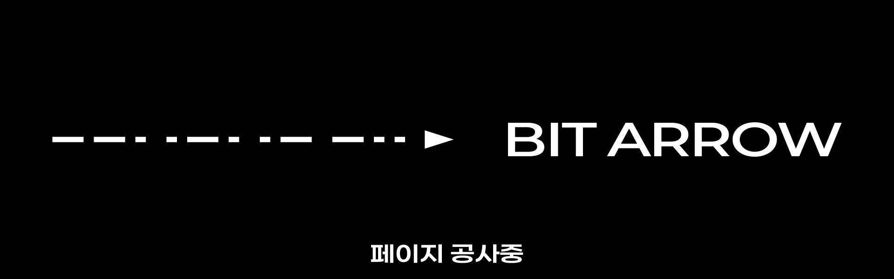
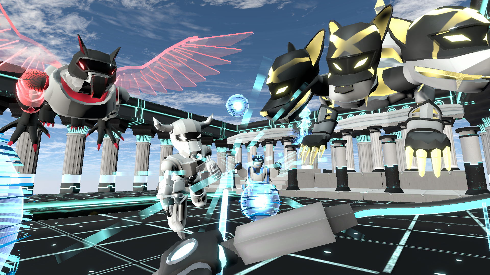
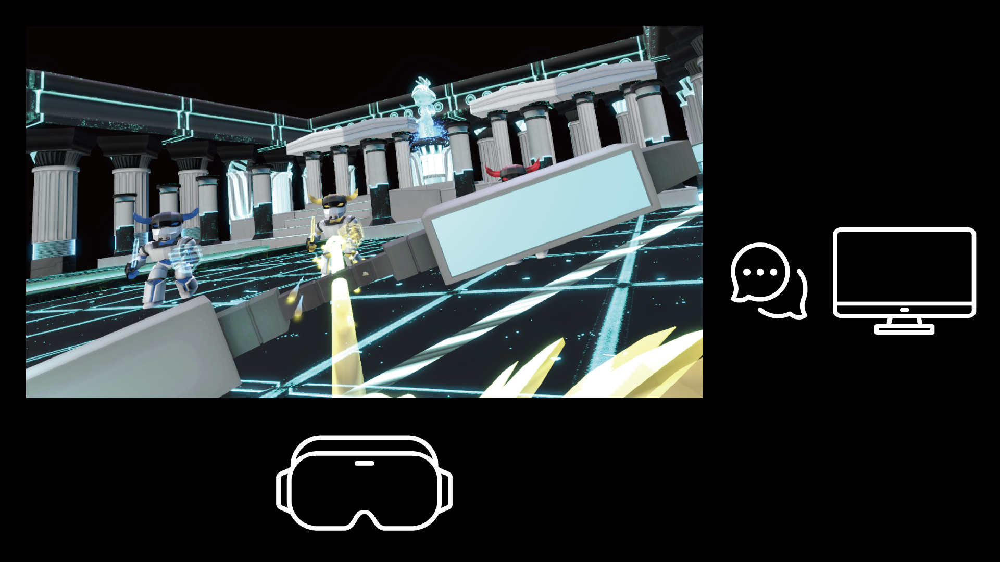
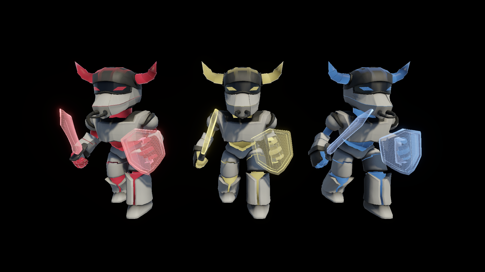
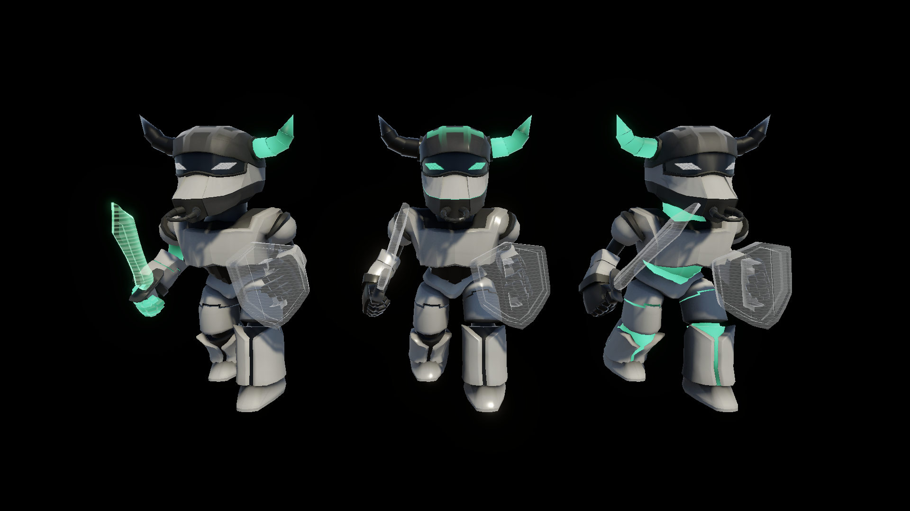
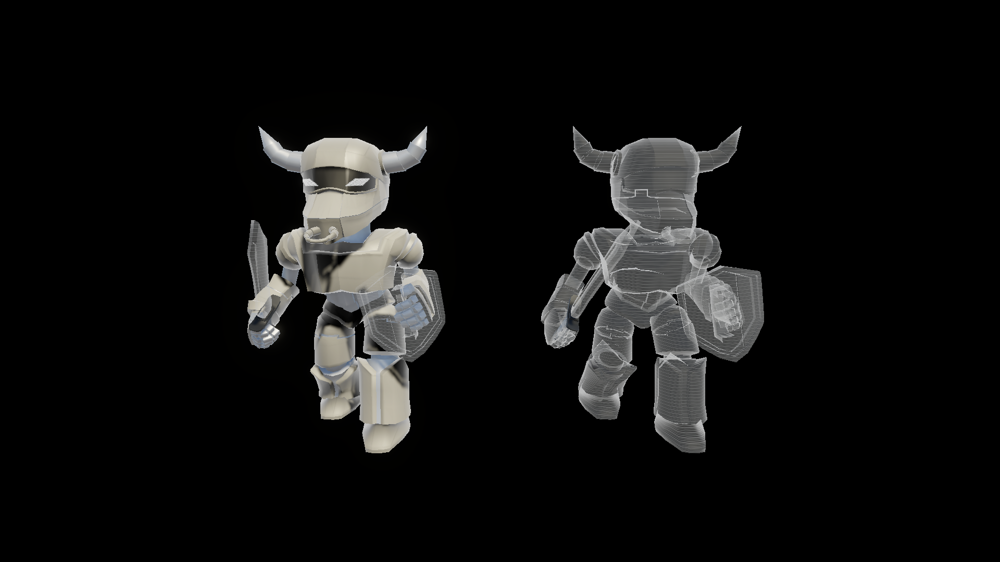
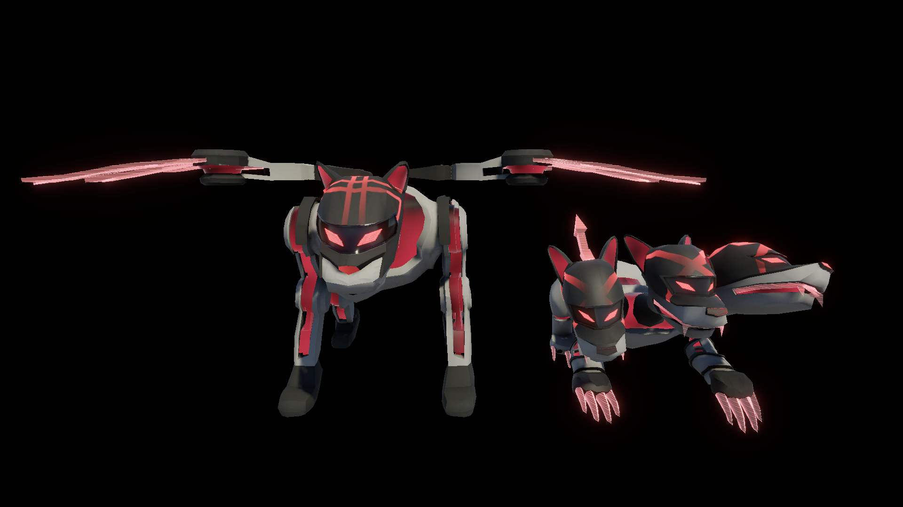
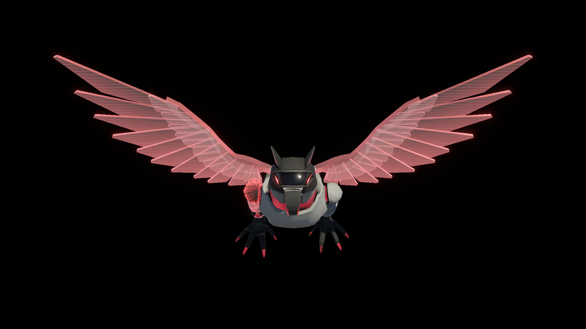

<body>
  

  
</body>

  

    <h2>Preview</h2>
    

      

        
      

      

        그리스 로마 신화의 에로스의 활에서 영감을 받아 활로 로봇을 해킹하는 테마를 바탕으로, 제한된 정보 속에서 서로 소통하고 협력하는 2인용 비대칭 VR 게임입니다.
      

      

        
      

      

        VR 플레이어는 활로 로봇을 해킹하고, PC 플레이어는 VR 플레이어를 지원합니다. 두 플레이어는 제한된 정보 속에서 서로 소통하고 협력해 미션을 수행합니다.
      

      

        
      

      

        빨간 로봇은 빨간 해킹 화살로, 파란 로봇은 파란 해킹 화살로만 해킹할 수 있으며, 화살의 종류는 PC 플레이어가 조정합니다.
      

      

        
      

      

        특이한 형태의 엘리트 몬스터는 어떤 해킹 화살들로 해킹해야 하는지 PC 플레이어만 알 수 있으며, 로봇의 외형과 필요한 화살 종류에 대해 소통해야만 해킹할 수 있습니다.
      

      

        
      

      

        색이나 형태가 잘 보이지 않는 로봇도 존재하며, 이를 파악하는 역할은 PC 플레이어에게 있습니다.
      

      

        
      

      

        로봇 미노타우르스에 이어, 로봇 스핑크스와 로봇 케르베로스의 모습입니다.
      

      

        
      

      

        특수 공격을 하는 로봇 그리핀의 모습입니다. 그리핀의 공격 위치와 범위는 PC 플레이어가 미리 파악할 수 있습니다.
      

    

  

